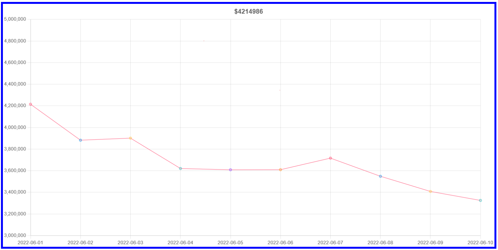

# evm_address_performance

Development in progress of a chart to view monetary performance of any Ethereum Virtual Machine (EVM) wallet/ contract address. URL: https://evm-address-performance-sqscbcan6a-uc.a.run.app/

### Current roadmap

1. Optimise API calls with asynchronous code
2. Use of process manager (PM2 node module)
3. Use of clusters to turn single thread JavaScript code execution to multi-threaded
   - May speed up user experience
4. Add the data retrieval of liquidity pool (LP) tokens and autocompounders
   - Price of LP tokens in wallet depends on the ratio of balance in wallet, the supply of LP token and its underlying price of tokens
   - Similar to LP tokens, Autocompounders adds a few extra layers of complexity to calculate its price
5. Beautiful front-end page
6. To include list of daily tokens (with logos), prices, balances
7. to trade space for time - increase space complexity for lower time complexity
8. create script to store daily blocks into DB
9. queue for received frontend address

